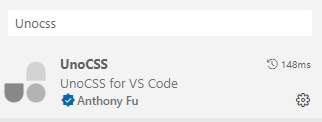

# Vue 3 + Vite

This template should help get you started developing with Vue 3 in Vite. The template uses Vue 3 `<script setup>` SFCs, check out the [script setup docs](https://v3.vuejs.org/api/sfc-script-setup.html#sfc-script-setup) to learn more.

该模板将帮助您开始在Vite中使用Vue 3进行开发。该模板使用Vue 3＜script setup＞SFC，请查看脚本设置文档以了解更多信息。

## Recommended IDE Setup

- [VS Code](https://code.visualstudio.com/) + [Volar](https://marketplace.visualstudio.com/items?itemName=Vue.volar) (and disable Vetur) + [TypeScript Vue Plugin (Volar)](https://marketplace.visualstudio.com/items?itemName=Vue.vscode-typescript-vue-plugin).

## 下载Unocss依赖

``` pnpm
pnpm i -D unocss @unocss/preset-uno @unocss/preset-attributify @unocss/preset-icons
```

unocss  
@unocss/preset-uno //工具类预设  
@unocss/preset-attributify //属性化模式支持  
@unocss/preset-icons //icon支持  

## 在vite.config.ts中引入

``` vue
import { defineConfig } from 'vite'
import vue from '@vitejs/plugin-vue'
// 引入Unocss
import Unocss from 'unocss/vite';
import { presetUno, presetAttributify, presetIcons } from 'unocss'
// https://vitejs.dev/config/
export default defineConfig({
  plugins: [
    vue(),
    Unocss({ // 使用Unocss
      presets: [
        presetUno(),
        presetAttributify(),
        presetIcons()],
    })
  ]
})
```

## 在main.ts中引入uno.css

``` vue
import { createApp } from 'vue'
import './style.css'
import App from './App.vue'
// 导入Unocss
import 'uno.css'
createApp(App).mount('#app')
```

## 使用

``` html
<div class="text-25px text-#ff6700 bg-#ccc">你好Unocss</div>
```

## vscode插件



## 样式查询地址

[样式查询地址](https://uno.antfu.me/)

## 使用图标

[图标地址](https://icones.js.org/)

你需要下载这个图标库,下载方式就是包名字后面的logos,就是你需要的图标库名,图标库名可以从对应的地址栏查看

<https://icones.js.org/collection/logos>

``` pnpm
pnpm i -D @iconify-json/logos
```

代码中使用

``` html
<div class="i-logos-atomic-icon w-50px h-50px"></div>
```

## Unocss 也可以增加一些预设css配置

在vite.config.ts增加 rules 规则

``` vue
import { defineConfig } from 'vite'
import vue from '@vitejs/plugin-vue'
import Unocss from 'unocss/vite';
import { presetUno, presetAttributify, presetIcons } from 'unocss'
// https://vitejs.dev/config/
export default defineConfig({
  plugins: [
    vue(),
    Unocss({
      presets: [
        presetUno(),
        presetAttributify(),
        presetIcons()
      ],
      rules: [ // 在这个可以增加预设规则, 也可以使用正则表达式
        [
          'p-c', // 使用时只需要写 p-c 即可应用该组样式
          {
            position: 'absolute',
            top: '50%',
            left: '50%',
            transform: `translate(-50%, -50%)`
          }
        ],
        [/^m-(\d+)$/, ([, d]) => ({ margin: `${d / 4}rem` })],
      ]
    })
  ]
})
```
